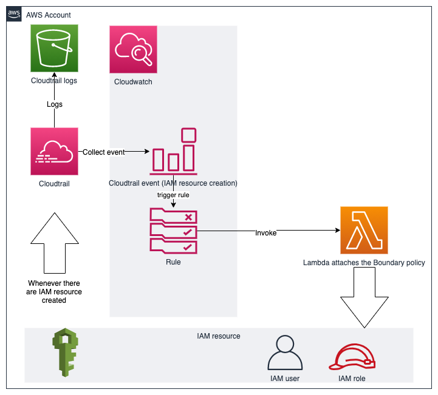

# The demo code for SCP workaround in China region

The solution itself is very stupid but it gets the work done.

## Architecture overview



Due to the fact that the AWS Cloudtrail has not been fully integrated with the AWS Organizations, this architecture has to be included in the landing zone blueprint, which will be deployed in every member account, in order to have it working in the similar manner as SCP. So let's just hope SCP could be landed in China as soon as possible so that we can get rid of this stupidity.

## Deployment instruction

### Prerequisite

Please make sure you have AWS CLI and terraform (versions ~> 0.14) installed and have correct AWS credentials configured.

### Deployment

If your default AWS CLI profile is pointing to your targeted account, then you do not have to change anything. Just execute the following command:

```code

cd scp-workaround
terraform init
terraform apply

```

If you are pointing some customized profile name to your targeted account, then make sure you do the following:

```code

cd scp-workaround
terraform init
terraform apply -var profile=<CUSTOM PROFILE>

```

## Disclaimer

This script is for demo only and since it is quite a bizard solution so it will not be maintained by any one. So do not use it for any production system.

In my own test, I discovered that it seems cloudtrail would need some minutes to take effect. Therefore, once the deployment is done, users need to wait for about three minute to have the cloudtrail being in effect. In addition, when there are new IAM resource getting created, it also takes about half an minute for the cloudtrail to collect the event and invoke the lambda. So be patient with this solution .....